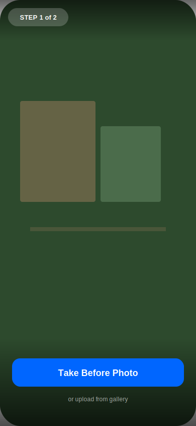
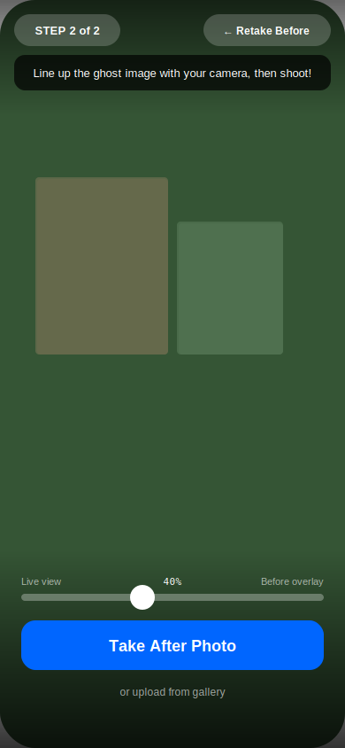
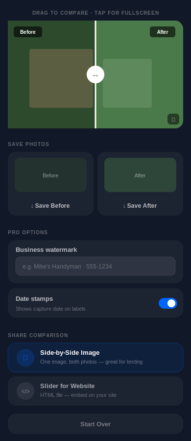

# Before/After Pro

**Take perfectly aligned before & after photos. Free, private, works on any phone.**

Use it now: **[vajradog.github.io/beforeafter](https://vajradog.github.io/beforeafter/)**

No app store, no download, no sign-up. Just open the link on your phone and start taking photos.

---

## How It Works

### Step 1: Take the Before Photo

Open the app and tap **Start Taking Photos**. Point your camera at the job and tap the big blue **Take Before Photo** button.

> Don't have camera access? No problem — tap "or upload from gallery" to pick a photo you already took.

---

### Step 2: Take the After Photo (with Ghost Overlay)

After you take the before photo, you'll see a **ghost image** of it layered over your live camera. This is the magic part:

**Line up the ghost image with your camera, then shoot!**

This makes sure both photos are taken from the same angle. Use the slider at the bottom to adjust how strong the ghost overlay is — slide left to see more of the live camera, slide right to see more of the before photo.

When everything lines up, tap **Take After Photo**.

---

### Step 3: Compare and Save

Now you'll see both photos in an **interactive slider**. Drag the white handle left and right to reveal the before and after.

From here you have several options:

#### Save Individual Photos
Tap **Save Before** or **Save After** to save each photo separately to your phone.

#### Side-by-Side Image
Tap **Side-by-Side Image** to create one image with both photos next to each other — perfect for texting to a client or posting on social media.

#### Slider for Website
Tap **Slider for Website** to download an HTML file with the interactive slider you can embed on your website.

---

## Pro Features

### Business Watermark

Type your business name in the **Business watermark** field (e.g., "Mike's Handyman Service - 555-1234"). It will appear at the bottom of your side-by-side exports.

You only need to type it once — it's saved automatically for next time.

### Date Stamps

The **Date stamps** toggle is on by default. It adds the date you took each photo to the BEFORE and AFTER labels on your side-by-side export, like:

**BEFORE - Feb 19, 2026 | AFTER - Feb 20, 2026**

Great for documentation, invoicing, and proof of work. Toggle it off if you don't want dates.

### Full-Screen Presentation Mode

**Double-tap the slider** or tap the expand icon in the bottom-right corner to go full screen. Hand your phone to the client and let them swipe back and forth — no buttons, no distractions, just the wow factor.

Tap the **X button** in the top-right corner to close.

---

## Tips for Best Results

1. **Hold your phone steady** at the same height and angle for both shots
2. **Use the ghost overlay** — it's there to help you match the angle perfectly
3. **Take the after photo from the same spot** you took the before photo
4. **Add your business name** as a watermark — every photo you share is free advertising
5. **Keep dates on** — clients and insurance companies love documentation

---

## Privacy

- All photos stay on your phone. Nothing is uploaded anywhere.
- No accounts, no sign-ups, no tracking.
- Works offline after the first visit (it's a PWA).
- Your watermark text is saved only on your device.

---

## Add to Home Screen

For the best experience, add it to your home screen so it works like a regular app:

**iPhone:** Open the link in Safari, tap the Share button, then tap **Add to Home Screen**.

**Android:** Open the link in Chrome, tap the three-dot menu, then tap **Add to Home Screen** or **Install App**.

---

Made for hardworking people. Free forever.
